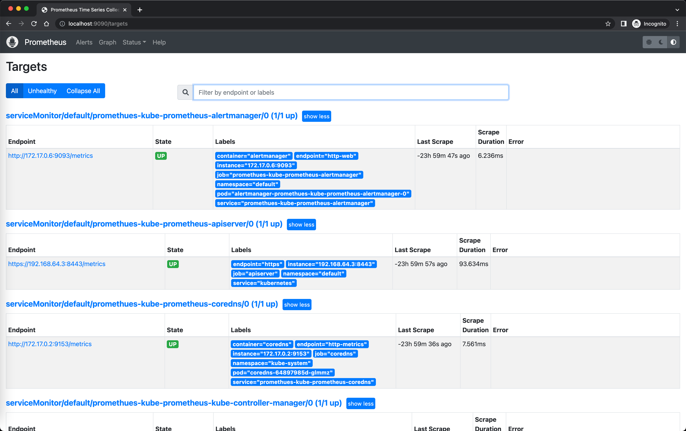
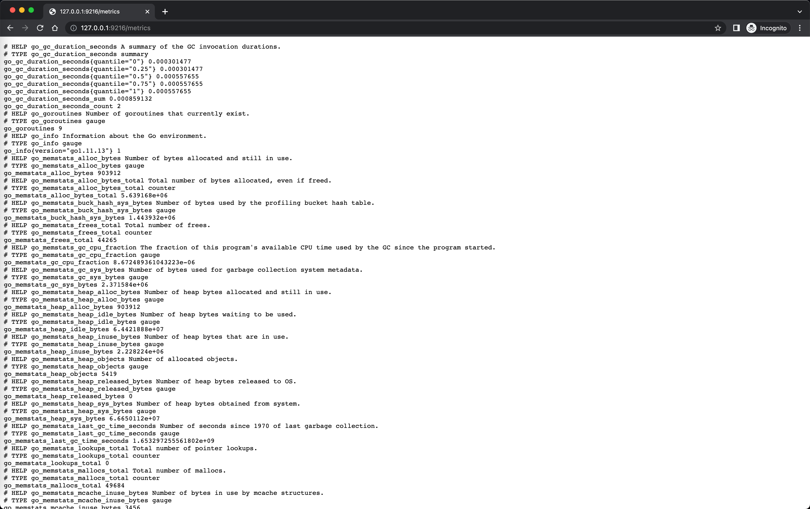

# demo-prometheus


## Pre-requisites
* minikube

## Running

#### Start minikube
`minikube delete && minikube start --kubernetes-version=v1.23.0 --memory=6g --bootstrapper=kubeadm \
--extra-config=kubelet.authentication-token-webhook=true --extra-config=kubelet.authorization-mode=Webhook \
--extra-config=scheduler.bind-address=0.0.0.0 --extra-config=controller-manager.bind-address=0.0.0.0`


#### Disable metrics-server
`minikube addons disable metrics-server`

#### Add repo
```
helm repo add prometheus-community https://prometheus-community.github.io/helm-charts
helm repo add stable https://charts.helm.sh/stable
helm repo update
```

#### Install prometheus
`helm install prometheus prometheus-community/kube-prometheus-stack`

#### Open prometheus
`kubectl port-forward service/prometheus-kube-prometheus-prometheus 9090`


#### Create mongodb resources
`kubectl apply -f mongodb-without-exporter.yaml`

#### Create mongodb exporter
`helm install mongodb-exporter prometheus-community/prometheus-mongodb-exporter -f values.yaml`

#### Open mongodb exporter
`kubectl port-forward service/mongodb-exporter-prometheus-mongodb-exporter 9216`


#### Open grafana
`k port-forward deployment/prometheus-grafana 3000`