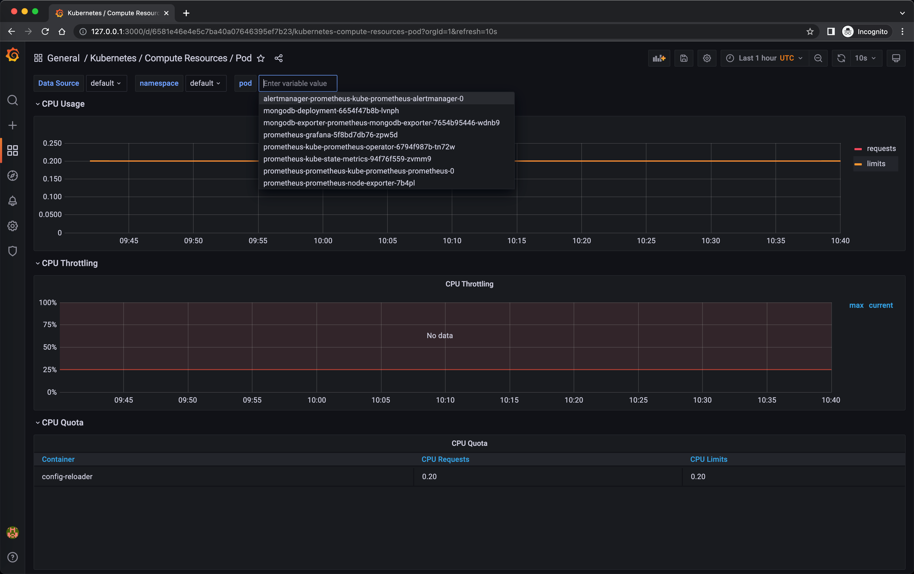
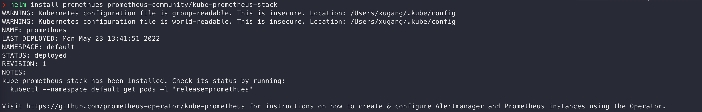

# demo-promethues

## Pre-requisites
* minikube

## Running

#### Start minikube
`minikube delete && minikube start --kubernetes-version=v1.23.0 --memory=6g --bootstrapper=kubeadm \
--extra-config=kubelet.authentication-token-webhook=true --extra-config=kubelet.authorization-mode=Webhook \
--extra-config=scheduler.bind-address=0.0.0.0 --extra-config=controller-manager.bind-address=0.0.0.0`

#### Disable metrics-server
`minikube addons disable metrics-server`

#### Install promethues
`helm install promethues prometheus-community/kube-prometheus-stack`

#### Open grafana
`k port-forward deployment/promethues-grafana 3000`